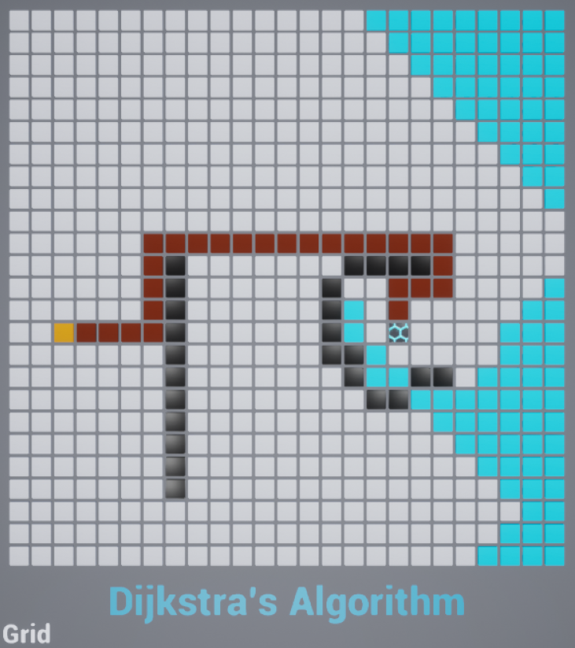

# [WIP] Pathfinding Grid in Unreal Engine 4
> An Unreal Engine 4 application that simulates pathfinding on a grid utilizing Dijkstra's Algorithm.

## To-Do
- Update material change delay to better visualize the algorithm
- Implement additional algorithms, such as A* and weighted Dijkstras

## Installation
- Clone this repo to your local machine using https://github.com/cshaheen13/Pathfinding
- Requires Unreal Engine 4

## Contact
#### Reach Out or Learn More About Me at:
- cshaheen13@gmail.com
- https://cshaheen13.wixsite.com/chaseshaheen

